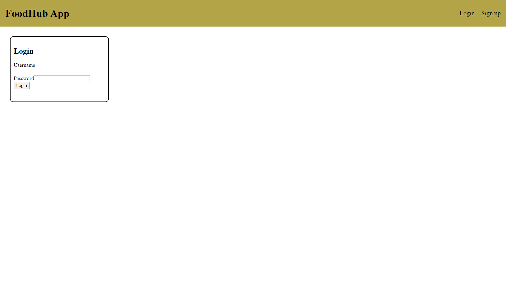

# FoodHub-Project
## Summary
This very simply project is a helpfull guide that proposes you a drink that (on our opinior) matches with the food you order.

## List of technologies
- Javascript
- HTML5
- CSS
- React.Js
- Node.Js
- Express.Js
- MongoDb Atlas
- Mongoose
- Axios
  
## Images of the website
Front Page

Sign Up

Login

Suggested drink

